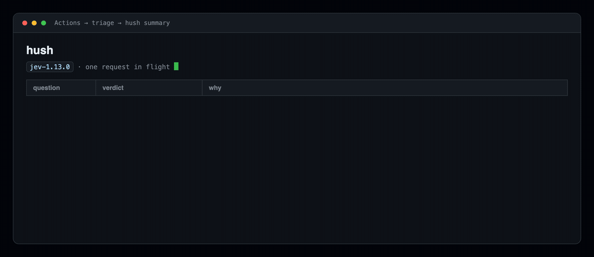

# hush

**Issue triage that stays quiet when it isn't sure.**

[](https://github.com/marketplace/actions/hush-issue-triage)
[](https://github.com/emreozyoruk/hush/actions/workflows/test.yml)
[](LICENSE)

A GitHub Action that reads every new issue and labels it — but only when it can
say how sure it is. When it can't, it does nothing and tells you why.



```
■ "Crash on save when filename is very long"
  bug            100% ≥ 80%, confidence 100%     → applied `bug`
  duplicate       97% ≥ 85%                      → applied `possible-duplicate`
  spam             3% < 90%                      → stayed quiet
  needs info      14% < 85%                      → stayed quiet

■ "🔥 BUY CHEAP FOLLOWERS 🔥"
  spam            99% ≥ 90%                      → applied `spam`
  label          best fit was "none" (100%)      → stayed quiet
```

Real output, 202–530 ms per issue.

And the part that matters, from [its own first issue](https://github.com/emreozyoruk/hush/issues/1) —
a report that could reasonably be a bug or a documentation problem:

```
label | stayed quiet | bug 72% / confidence 63% — below 80% / 60%
```

It had an answer. It wasn't sure enough. So it said nothing.

## Why another triage bot

Because the others talk when they shouldn't.

LLM triage bots return prose with no calibrated notion of certainty, so a 55%
hunch and a 99% read look identical coming out. You get confident-sounding labels
on issues the model never understood, and after the third wrong one you turn it
off.

hush runs on [Jev](https://typesafe.ai), a decision model that returns a
*probability* instead of a sentence. Every verdict comes with the number that
produced it, and every threshold is yours:

```yaml
label-threshold: 0.80        # how likely the label must be
label-confidence-threshold: 0.60  # and how much the model must trust its own read
spam-threshold: 0.90
needs-info-threshold: 0.85
duplicate-threshold: 0.85
```

Below the line, it abstains. Silence is the default behaviour, not the failure mode.

It is also cheap enough to leave on: one request per issue, around
**$0.00002**. Ten thousand issues cost about twenty cents.

## Try it on a backlog you already have

Before adding anything to a repository, point it at one:

```bash
export TYPESAFE_API_KEY=...          # console.typesafe.ai/keys
npx github:emreozyoruk/hush owner/repo
```

```
remotion-dev/remotion · 6 open issues · nothing will be written

#11474 Codemods: It always creates a full copy of the enti…  needs-more-info, bug
      · spam       spam 4% < 90%
      · duplicate  duplicate 10% < 85%
      ✓ needs_info needs info 90% ≥ 85%
      ✓ label      bug 92% ≥ 80%, confidence 89% ≥ 60%
#11469 Video matting: Allow setting default…                 feature
      · spam       spam 3% < 90%
      · duplicate  duplicate 22% < 85%
      · needs_info needs info 79% < 85%
      ✓ label      feature 100% ≥ 80%, confidence 100% ≥ 60%

6 of 6 would get a label · 0 left alone
237 ms average · $0.00033 total
```

Those two rows are the whole design: 90% cleared the needs-info threshold, 79%
did not, and the second issue was left alone on that question.

It reads issues and writes nothing — there is no `--apply`. Use `--limit`,
`--labels` with your own taxonomy, and `--json` to pipe it somewhere.

## Install

```yaml
# .github/workflows/triage.yml
name: triage
on:
  issues:
    types: [opened, edited, reopened]

permissions:
  issues: write

jobs:
  hush:
    runs-on: ubuntu-latest
    steps:
      - uses: emreozyoruk/hush@v1
        with:
          typesafe-api-key: ${{ secrets.TYPESAFE_API_KEY }}
          apply: false   # watch it first
```

Get a key at [console.typesafe.ai/keys](https://console.typesafe.ai/keys) and add
it as a repository secret.

**Start with `apply: false`.** hush writes a table into the job summary of every
run showing what it would have done. Read a week of those, move your thresholds,
then set `apply: true`.

## Your labels, your words

The default set is `bug`, `feature`, `docs`, `question`. Replace it with your own —
the description is what the model judges against, so write it the way you would
explain the label to a new maintainer:

```yaml
- uses: emreozyoruk/hush@v1
  with:
    typesafe-api-key: ${{ secrets.TYPESAFE_API_KEY }}
    apply: true
    comment: true
    labels: |
      {
        "bug": "A defect: the library does something other than what the docs say.",
        "performance": "It works, but it is too slow or uses too much memory.",
        "platform/windows": "Specific to Windows; does not reproduce on Linux or macOS.",
        "good first issue": "Small, well-understood, and does not need project context."
      }
```

A label is only ever applied if it already exists in the repository. hush never
creates labels, never removes one, and never touches a label a human added.

## What it decides

| question | type | what it does |
|---|---|---|
| **label** | one of yours, or `none` | Applies the category when both the probability and the model's confidence clear your thresholds. |
| **spam** | yes/no | Applies `spam`. |
| **needs more info** | yes/no | Applies `needs-more-info` when a maintainer would have to ask before acting. |
| **duplicate** | yes/no | Compares against the 40 most recent open issues and applies `possible-duplicate`. |

All four travel in **one** request, which is why triage costs a fraction of a cent
and finishes before the page reloads.

## Inputs

| input | default | |
|---|---|---|
| `typesafe-api-key` | — | Required. |
| `github-token` | `${{ github.token }}` | Needs `issues: write` to apply anything. |
| `apply` | `false` | Act, rather than only report. |
| `comment` | `false` | Explain the labels in a comment. |
| `labels` | the four above | JSON object of name → meaning. |
| `check-duplicates` | `true` | Compare against other open issues. |
| `label-threshold` | `0.80` | |
| `label-confidence-threshold` | `0.60` | |
| `spam-threshold` | `0.90` | |
| `needs-info-threshold` | `0.85` | |
| `duplicate-threshold` | `0.85` | |

## What it will not do

- Close, lock, delete or edit anything. It labels, and optionally comments.
- Apply a label that does not already exist in your repository.
- Remove or overwrite a label a person set.
- Act at all while `apply` is false.

Where it is unsure, it leaves the issue exactly as it found it. That is the
entire idea.

## Development

```bash
npm test     # the decision layer is pure; the thresholds are tested offline
```

No build step and no dependencies — the action runs the files in `src/` directly
on Node 20.

## Licence

MIT
